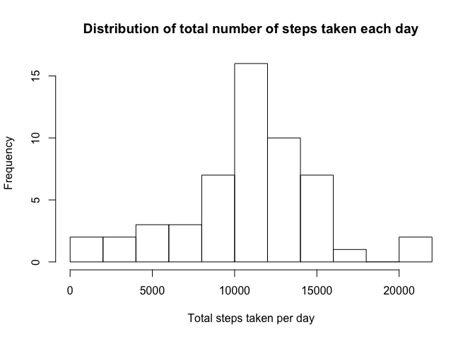
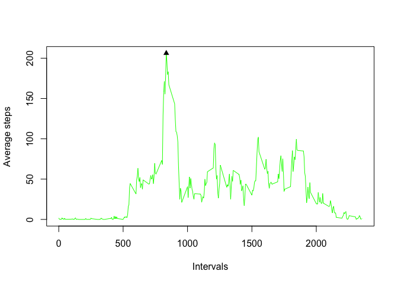
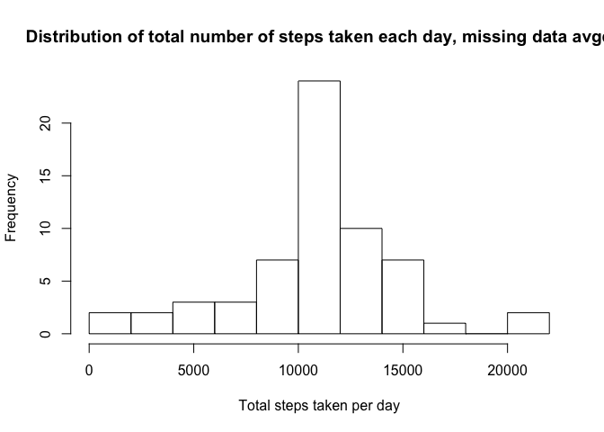
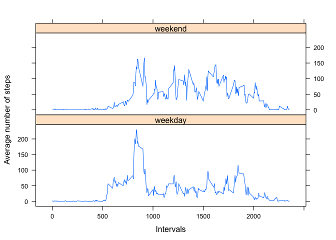

***

## Loading and preprocessing the data

```r
activity <- read.csv("activity.csv")
```

## What is mean total number of steps taken per day?
Histogram of the total number of steps taken each day

```r
# Calculate total amount of steps per each day
aggregated_steps <- aggregate(steps ~ date, data = activity, sum)
# Plot histogram with 10 bins
hist(aggregated_steps$steps, breaks = 10, main = "Distribution of total number of steps taken each day", xlab = "Total steps taken per day")
```

<!-- -->

Mean and median total number of steps taken per day

```r
# Calculate mean
mean(aggregated_steps$steps)
```

```
## [1] 10766.19
```

```r
# Calculate median
median(aggregated_steps$steps)
```

```
## [1] 10765
```

## What is the average daily activity pattern?
Time series plot of the 5-minute interval and the average number of steps taken, averaged across all days  

```r
# Calculate total amount of steps per each day
aggregated_intervals <- aggregate(steps ~ interval, data = activity, mean)
# Plot time series
plot(aggregated_intervals$interval, aggregated_intervals$steps, type="l", xlab= "Intervals", ylab= "Average steps", col="green")
points(aggregated_intervals$interval[which.max(aggregated_intervals$steps)], max(aggregated_intervals$steps), pch = 17)
```

<!-- -->

> Which 5-minute interval, on average across all the days in the dataset, contains the maximum number of steps?

Interval + average number of steps

```r
# Calculate interval
aggregated_intervals$interval[which.max(aggregated_intervals$steps)]
```

```
## [1] 835
```

```r
# With average number of steps
max(aggregated_intervals$steps)
```

```
## [1] 206.1698
```

## Imputing missing values
Calculate and report the total number of missing values in the dataset 

```r
table(is.na(activity$steps))
```

```
## 
## FALSE  TRUE 
## 15264  2304
```
We will use mean for 5-minute interval to impute missing values  
Create a new dataset that is equal to the original dataset but with the missing data filled in.

```r
# Average out steps according to interval
new <- ave(activity$steps, activity$interval, FUN = function(x) mean(x, na.rm = TRUE))
# Copy original dataset to fulfill requirement to obtsain a new dataset
activity_complete <- activity
# Replace NA's with average values from variable "new" that stores averaged data for all intervals
activity_complete$steps[is.na(activity_complete$steps)==TRUE] <- new[is.na(activity_complete$steps)==TRUE]
```

Make a histogram of the total number of steps taken each day and Calculate and report the mean and median total number of steps taken per day. 


```r
# Calculate total amount of steps per each day, this time on new dataset
aggregated_steps <- aggregate(steps ~ date, data = activity_complete, sum)
# Plot histogram with 10 bins
hist(aggregated_steps$steps, breaks = 10, main = "Distribution of total number of steps taken each day, missing data avgd", xlab = "Total steps taken per day")
```

<!-- -->

```r
# Calculate mean
mean(aggregated_steps$steps)
```

```
## [1] 10766.19
```

```r
# Calculate median
median(aggregated_steps$steps)
```

```
## [1] 10766.19
```

> Do these values differ from the estimates from the first part of the assignment? What is the impact of imputing missing data on the estimates of the total daily number of steps?  

Conclusions:  
* Frequesncies in histogram increased for all bins that had values  
* This means that missing values were distributed evenly troughout dataset  
* Mean and median equalized because a number of days with missing values for all intervals obtained the same mean value for steps per day  

## Are there differences in activity patterns between weekdays and weekends?

Create a new factor variable in the dataset with two levels -- "weekday" and "weekend" indicating whether a given date is a weekday or weekend day.

```r
# Convert date to POSIXlt
activity_complete$date <- strptime(activity_complete$date, "%Y-%m-%d")
# Create a new variable
activity_complete$day <- ifelse(weekdays(activity_complete$date) %in% c("Saturday", "Sunday"), "weekend", "weekday")
```

Panel plot containing a time series plot of the 5-minute interval and the average number of steps taken, averaged across all weekday days or weekend days.

```r
# Calculate average amount of steps per interval and day of week
aggregated_intervals <- aggregate(steps ~ interval + day, data = activity_complete, mean)
# Plot time series
library("lattice")
xyplot(steps ~ interval|day, data=aggregated_intervals, type='l', layout=c(1,2), xlab= "Intervals", ylab= "Average number of steps")
```

<!-- -->
